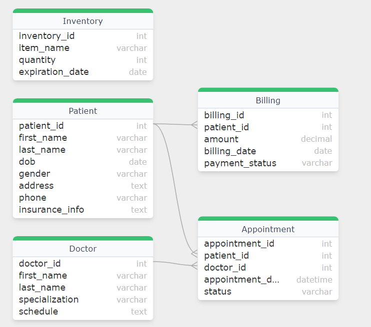
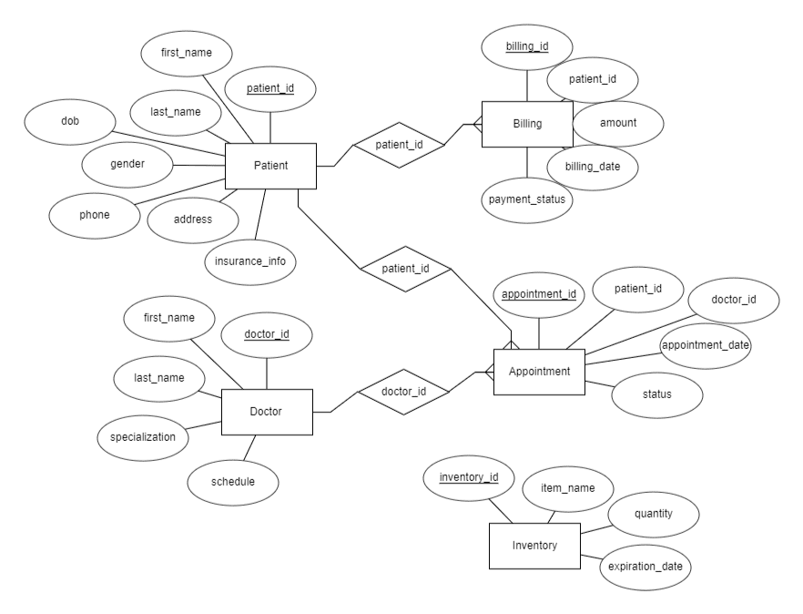

# Healthcare Management System (HMS)

## Overview
This repository contains the Healthcare Management System (HMS) project, designed to streamline healthcare operations such as patient management, appointments, billing, and medical records. The system is backed by an SQL database, with an Entity-Relationship (ER) diagram, database schema, and sample 700+ records.

## Key Features
Patient Management: Store and manage patient details, medical history, and appointments.
Appointment Scheduling: Track patient appointments with healthcare providers.
Billing Management: Handle billing, charges, and payments for patients.
Medical Records: Maintain and retrieve patient diagnoses and treatment histories.
Database Schema: SQL-based schema defining all necessary tables (patients, doctors, appointments, etc.).
Performance Queries: Over 100 queries to demonstrate system functionality.

3. Insert Sample Data
Populate the database with sample records (700+ entries) using the provided data in the records/ folder.

4. Perform Queries
Run the queries in the queries/ folder to interact with the database. These queries cover operations like adding patients, scheduling appointments, and generating reports.

# Database Schema

# ER Diagram

## Directory Structure Example:

Healthcare-Management-System/
│
├── schema/
│   └── schema.sql  # SQL database schema
│
├── records/        # Sample data (700+ records)
│
├── queries/        # SQL queries folder
│
├── er_diagram/     # ER diagram (visual representation)
│
└── LICENSE         # License file

---

This structure and the updated README now make it clear where the database schema is located (under schema/) and how to use it. Let me know if you need more changes!

